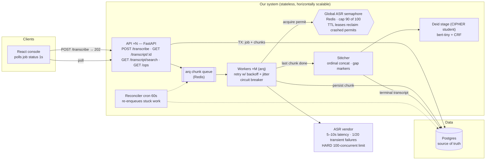

# Transcription Service

An audio-transcription job service: clients submit jobs of audio chunks, workers fan the chunks out to a flaky third-party ASR vendor under a **hard 100-concurrent-request cap**, and the stitched transcript comes back **de-identified by default** — PHI masked by a small on-device NER model before anything is served.

Built for the [take-home brief](design/task.txt); the full system design (requirements, trade-offs, scaling to 10× DAU) is in [design/DESIGN.md](design/DESIGN.md).



## Run it

Requires Docker. First boot builds images and applies migrations:

```sh
make up
```

| Service | URL |
| --- | --- |
| Demo console | http://localhost:5173 |
| API | http://localhost:8000 (`/healthz`, `/ops`) |
| Mock ASR vendor | http://localhost:3000 ([provided](mock-asr/), untouched) |

`make down` tears everything down (including volumes).

## Demo script

1. **Happy path + partial failure** — on [Submit](http://localhost:5173), keep the pre-selected chunks and tick *"include a chunk that always fails"* (`audio-file-8.wav`). Submit, then watch the chunk ledger: parallel fan-out completes healthy chunks in seconds; the poison chunk burns 4 attempts (dots in the ledger) and the job lands `COMPLETED_WITH_ERRORS` with an inline `[chunk N unavailable]` marker in the transcript.
2. **De-identification** — the transcript renders with `[NAME]`, `[DATE]`, `[MRN]`… mask chips. The *show raw* toggle reveals the original text — every raw read writes an `audit_log` row (`?view=raw` server-side).
3. **Crash recovery** — mid-job, `docker compose kill -s SIGKILL worker`. The UI stalls (the worker has no restart policy, on purpose). `docker compose start worker` — the reconciler re-enqueues stuck chunks and the job completes. Crashed workers' semaphore permits self-expire via TTL, so the vendor budget is never leaked.
4. **Concurrency proof** — open [System](http://localhost:5173/system) and press **Run burst** (or run `make loadtest` for a scored report) (40 jobs × 8 chunks — naive parallelism would be 320 concurrent ASR calls). The high-water mark climbs toward, and never past, the cap. A committed run: [design/loadtest-results.md](design/loadtest-results.md).

## Tests

| Command | What it proves |
| --- | --- |
| `make unit` | Retry taxonomy (fake clock), semaphore cap under contention (fakeredis), stitcher, cursor pagination, idempotency, CRF/Viterbi vs brute force, loss numerics, mask alignment |
| `make integration` | API contract + worker orchestration against real Postgres (testcontainers): guarded transitions, exactly-one-stitch race, failure branches, `/ops` counters |
| `make e2e` | Crash recovery (SIGKILL a worker mid-burst) and the concurrency proof: 320-chunk burst, high-water mark ≤ 90 |
| `make smoke` | Playwright against the live stack: poison-chunk job to terminal, mask chips + gap marker visible, System panel within cap |
| `make loadtest` | Burst through the public API; latency percentiles + budget adherence report |
| `make lint` / `make frontend-test` | Ruff; `tsc` + vitest |

Backend tests run with `uv` and need Docker (testcontainers).

## De-identification (CIPHER at take-home scale)

`backend/app/deidentification/` implements a [CIPHER](https://arxiv.org/abs/2510.01551)-style student: a rule-ensemble teacher with deliberately varied annotators produces soft labels over synthetic clinical text, distilled (focal soft CE + CRF NLL) into a `bert-tiny` + CRF tagger with batched Viterbi decoding. Six PHI types, recall-first posture (`AGE` masked unconditionally, orphan `I-X` spans repaired open).

Trained weights are committed (~18 MB) so the demo works on first clone; `make deid` retrains from scratch in ~1 min on CPU. Current [metrics](backend/app/deidentification/artifacts/metrics.json): **0.98 overall recall, ≥ 0.93 per type** — on synthetic, in-distribution data only. The CIPHER paper reports a ~19-point F1 drop moving to real clinical text; these numbers certify the pipeline, not clinical-grade performance.

## Configuration

All knobs live in [`backend/app/config.py`](backend/app/config.py) and are set in [`docker-compose.yml`](docker-compose.yml):

| Knob | Default | Why |
| --- | --- | --- |
| `ASR_MAX_CONCURRENCY` | 90 | Vendor cap is 100; the 10-slot margin absorbs the TTL-expiry double-count window. When the vendor raises the limit, this is the one value to change. |
| `ASR_LEASE_TTL_SECONDS` | 30 | Permit self-expiry (> the 15 s ASR timeout) — crashed workers can't leak budget |
| `RETRY_MAX_ATTEMPTS` / `RETRY_BASE_DELAY` / `RETRY_MAX_DELAY` | 4 / 0.5 / 8 | Full-jitter exponential backoff; fast first retry protects the <20 s happy path |
| `CHUNK_STUCK_SECONDS` | 120 | Reconciler threshold — > lease TTL + max call, so it never races a live call |
| `RECONCILER_INTERVAL_SECONDS` | 60 | Crash-recovery sweep cadence |

## Scaling 1k → 10k DAU

Everything on our side is stateless and scales by adding replicas (API pods, arq workers); the global Redis semaphore keeps the vendor budget correct regardless of worker count, so the vendor cap — not our system — is the bottleneck. Postgres gets read replicas for the read-heavy poll/search path before it needs anything else. The full lever-by-lever walkthrough is in [DESIGN.md §7](design/DESIGN.md); measured evidence under burst load is in [design/loadtest-results.md](design/loadtest-results.md).

## Repo layout

```
backend/    FastAPI API + arq workers + deid model (pytest: unit/integration/e2e/deid)
frontend/   React demo console (Vite + TS + Tailwind; Playwright smoke)
mock-asr/   Provided mock ASR vendor — untouched
design/     Task brief, system design doc, diagrams, load-test results
```

AI tooling used during development (prompts, plans) is checked in under `design/`.
