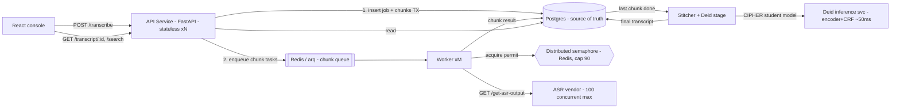

# Transcription Service — System Design

**Take-home for Ambience · Backend Transcription Service**
Author: (you) · Time-boxed to ~8 hours of implementation · This doc doubles as the 15–20 min presentation script.

---

## 1. Requirements

### 1.1 Functional (top 3)

1. **Users can submit a transcription job** for a list of audio chunk paths (`POST /transcribe`) and receive a `jobId` immediately.
2. **Users can fetch a job's result** (`GET /transcript/{jobId}`) — a stitched transcript, per-chunk statuses, job status, and completion time.
3. **Users can search jobs** (`GET /transcript/search?jobStatus=&userId=`) across all time, with both filters optional.

*Bonus (this submission):* **Clinical de-identification** — transcripts are PHI-masked before they are searchable, using a distilled encoder+CRF student model (CIPHER, §8).

### 1.2 Non-functional (the ones that shape the design)

| # | Requirement | Target |
|---|---|---|
| NF1 | **Fault tolerance** | Jobs survive server/worker restarts; no lost or duplicated work |
| NF2 | **ASR concurrency ceiling** | **Never** exceed 100 simultaneous ASR requests, globally, across all workers — vendor ban / financial risk |
| NF3 | **Latency** | End-to-end transcript < 20 s happy path (each ASR call is 5–10 s) |
| NF4 | **Scalability** | 1,000 DAU today → 10,000 DAU in 6 months without redesign |
| NF5 | **Fault isolation** | 1/20 ASR calls fail transiently; some chunks fail permanently — degrade per-chunk, not per-job |
| NF6 | **HIPAA posture** | Transcripts are PHI; encrypt, audit, minimize, de-identify (§8) |

NF2 is the defining constraint: it is a **global, shared, externally-enforced budget**, which forces distributed coordination the moment we run more than one worker.

### 1.3 Napkin math (only where it changes a decision)

**Today (1,000 DAU):**
- 8 h shift ÷ 30 min visits → ≤ 16 visits/provider/day → **~16,000 visits/day**
- 30 min visit ÷ 5 min chunk cap → **6 chunks/visit** → **~96,000 ASR calls/day**
- Concentrated in an 8 h working window → **λ ≈ 3.3 ASR calls/sec** average
- Little's Law with W ≈ 7.5 s per call: **L = λ·W ≈ 25 concurrent ASR requests** average; a 3× peak ≈ **75 concurrent** → *fits under 100 today, but with little headroom at peaks*.

**6 months (10,000 DAU):**
- λ ≈ 33 calls/sec needed; the vendor cap yields max throughput of **100 ÷ 7.5 s ≈ 13 calls/sec**.
- **The vendor cap, not our system, becomes the bottleneck.** Everything on our side must scale horizontally so that when the vendor raises the limit (they said it will increase), we change **one config value**. See §7.

**Data sizing:**
- Transcript: 30 min × 140 wpm ≈ 4,200 words ≈ **~28 KB text/visit** → ~450 MB/day today, ~4.5 GB/day at 10× → comfortably Postgres for years; partition by month later.
- Audio (~1 MB/min → 30 MB/visit) never touches our service — we pass **paths**, not bytes. This keeps our API tiny and stateless.
- A 120-min spike visit = 24 chunks — still one job, still parallelizable within budget.

---

## 2. Core entities

- **Job** — one transcription request: `jobId`, `userId`, status, `completedTime`, stitched `transcriptText` (+ de-identified variant).
- **Chunk** — one audio path within a job: ordinal position, status, attempt count, per-chunk transcript text.
- **User** — referenced by `userId` only (auth out of scope).

---

## 3. API

REST, plural-noun resources, one endpoint per functional requirement. `userId` comes from the request body here only because auth is explicitly out of scope; in production it is derived from the auth token, never trusted from the body.

```
POST /transcribe
  body: { audioChunkPaths: string[], userId: string }
  → 202 { jobId: string }            # accepted, async — never blocks on ASR

GET /transcript/:jobId
  → 200 TranscriptResult | 404

GET /transcript/search?jobStatus=&userId=&cursor=&limit=
  → 200 { results: TranscriptResult[], nextCursor? }

TranscriptResult {
  jobId, userId,
  transcriptText: string,            # stitched, in chunk order; de-identified by default (§8)
  chunkStatuses: { [audioPath]: "PENDING"|"PROCESSING"|"COMPLETED"|"FAILED" },
  jobStatus: "PENDING"|"PROCESSING"|"COMPLETED"|"COMPLETED_WITH_ERRORS"|"FAILED",
  completedTime: ISOString | null
}
```

Design choices worth calling out:
- **202 + polling**, not a blocking POST. The 20 s happy path is a *target*, not a guarantee (retries can exceed it), so the API contract must not couple client connections to ASR latency. (Alternative considered: long-poll / SSE / webhooks — nice production add, unnecessary for scope; polling `GET /transcript/:jobId` is the demoable minimum.)
- **Idempotency-Key header** accepted on POST (hash stored on the job) so client retries don't double-submit work.
- **Cursor pagination** on search — "search across all time" means offset pagination will die at scale.

---

## 4. High-level design

*(See `architecture.mermaid` — walk left → right, following one request.)*



**Flow, one endpoint at a time:**

1. **POST /transcribe** — API validates input, writes `job` + N `chunk` rows in one transaction (status `PENDING`), enqueues one task per chunk, returns `jobId`. Nothing slow happens on the request path.
2. **Workers** consume chunk tasks. For each: acquire a **global ASR permit** → call ASR → release permit → persist chunk transcript/status → if this was the job's last outstanding chunk, trigger **stitch**.
3. **Stitch** — concatenate chunk texts in ordinal order (failed chunks become an inline `[chunk N unavailable]` marker), run **de-identification** (§8), write final transcript + terminal job status + `completedTime`.
4. **GET endpoints** read Postgres directly. Search hits a composite index `(user_id, job_status, created_at DESC)`.

**Data model (interesting fields only):**

```
jobs(id uuid PK, user_id, status, transcript_text, transcript_deid,
     idempotency_key UNIQUE NULLS DISTINCT, created_at, completed_time)
chunks(id PK, job_id FK, ordinal int, audio_path, status,
       attempts int, transcript_text, last_error, updated_at)
-- indexes: chunks(job_id), jobs(user_id, status, created_at DESC)
```

**Technology choices & alternatives:**

| Decision | Chose | Alternative considered | Why |
|---|---|---|---|
| Backend | **Python / FastAPI** | Node/Fastify | Pydantic gives typed request/response contracts for free; async-native for I/O-bound fan-out. The Fastify starter is the *vendor mock*, not our service — the take-home explicitly says use your strongest stack |
| Source of truth | Postgres + SQLAlchemy 2.0 (async) + Alembic | DynamoDB | Transactions for job+chunks atomicity; relational search endpoint is free; migrations are reviewable; boring and right |
| Workers/queue | **arq** (asyncio jobs on Redis) | Celery | ASR calls are pure I/O — one asyncio worker process comfortably holds dozens of in-flight HTTP calls, which matches the semaphore model exactly. Celery is the battle-tested alternative but its prefork model wastes a process per in-flight request; I'd accept Celery+gevent in review |
| ASR HTTP client | httpx (async, explicit timeouts) | aiohttp | First-class timeout API; respx makes it trivially testable |
| ASR throttle | Redis semaphore w/ TTL leases | Fixed worker-pool sizing (M workers × K each ≤ 100) | Pool-sizing breaks under autoscaling and deploy overlap (old+new pods both hold budget). A shared semaphore is correct regardless of worker count |
| Frontend | **React (Vite + TS) + TanStack Query** | curl / Postman demo | Polling, per-chunk status, and the kill-the-worker recovery demo are far more legible on a live UI; TanStack Query gives the poll loop for free |
| Result delivery | Poll | Webhooks/SSE | Scope; the React console polls `GET /transcript/:jobId` every 1s while non-terminal |

**Repository layout (monorepo):**

```
/backend
  app/api/          # FastAPI routers: transcribe, transcript, search
  app/workers/      # arq tasks: process_chunk, stitch_job, reconciler
  app/core/         # asr_client (httpx + retry + breaker), semaphore, config
  app/models/       # SQLAlchemy models + Alembic migrations
  app/deid/         # CIPHER student: model.py, crf.py, viterbi.py, losses.py
  tests/            # pytest: unit / integration / e2e
/frontend
  src/pages/        # SubmitJob, JobDetail, Search
  src/api/          # typed client generated from FastAPI's OpenAPI schema
/mock-asr           # the provided Fastify vendor mock, untouched
docker-compose.yml  # api + worker + postgres + redis + mock-asr + frontend
```

---

## 5. Deep dive — the ASR budget (NF2 + NF3 + NF5)

This is where the system earns its keep.

### 5.1 Global concurrency limiter

- Redis-backed **counting semaphore, cap = 90** (10 held back as safety margin for deploy overlap, clock skew, and crash-orphaned permits).
- Each permit is a Redis key with a **TTL lease (~30 s > max ASR timeout)**: if a worker dies mid-call, its permit expires instead of leaking budget forever — this is the fault-tolerance story for the limiter itself.
- Acquire is non-blocking with backoff: a worker that can't get a permit re-queues the task with a short delay rather than holding a connection.
- **Assertion in tests:** the mock ASR server counts in-flight requests; the e2e suite fails if the observed max ever exceeds 100 (§9).

### 5.2 Retry policy & failure taxonomy

| ASR response | Classification | Action |
|---|---|---|
| 500 | Transient (1/20 baseline) | Retry, exponential backoff + full jitter, max 4 attempts |
| Timeout (>15 s) | Transient | Cancel, release permit, retry as above |
| 429 | *Should never happen* — means our limiter is wrong | Trip circuit breaker, alert, hard back-off |
| 404 | Permanent | Chunk → `FAILED` immediately, no retry |
| 4 failed attempts | Poison chunk ("some segments always fail") | Chunk → `FAILED`, job continues |

- **Per-chunk isolation:** one poison chunk yields `COMPLETED_WITH_ERRORS` with `[chunk N unavailable]` inline and truthful `chunkStatuses` — the client gets 5/6 of a visit rather than nothing. Job is `FAILED` only if *all* chunks fail.
- **Circuit breaker** around the ASR client: if failure rate spikes far above 5%, open the breaker, park tasks with delay, and stop burning budget on a down vendor.
- **Idempotent chunk processing:** chunk task handler checks current status before calling ASR, so a redelivered task after a crash never double-spends or double-writes.

### 5.3 Latency budget (< 20 s happy path)

- All chunks of a job fan out **in parallel** (6 for a 30-min visit; 24 for a 120-min spike — still ≪ budget at today's load).
- Happy path: max(chunk latencies) ≈ 5–10 s + stitch (ms) + deid (~50 ms) → **~10 s typical**.
- One transient failure: 10 s + backoff (~1 s) + 10 s retry ≈ **21 s worst case** — right at the edge; this is why retry #1 uses minimal backoff and later attempts back off harder. P(≥1 failure among 6 chunks) = 1 − 0.95⁶ ≈ **26%** of jobs see at least one retry, so this path is common, not exceptional — it's designed, not hoped-around.

---

## 6. Deep dive — fault tolerance (NF1)

**Invariant: Postgres is the source of truth; Redis/queue state is reconstructible.**

- Every state transition (chunk PENDING→PROCESSING→terminal, job transitions) is persisted *before* it is acted on. Workers are stateless.
- **Crash mid-ASR-call:** permit TTL reclaims the budget; arq's job timeout + `max_tries` redelivers the task; the idempotent handler re-checks status and re-calls ASR. At-least-once delivery + idempotent handler ⇒ effectively-once outcome.
- **Redis loss (worst case):** a **reconciler** (cron, every 60 s) scans Postgres for chunks stuck in `PENDING/PROCESSING` beyond a deadline and re-enqueues them. This single loop also mops up any enqueue-after-commit races.
- **Restart demo (live):** submit a job, `kill -9` the worker mid-flight, restart, show the job complete. This is the money shot of the presentation.
- Terminal states are immutable; stitching is deterministic and re-runnable.

---

## 7. Deep dive — scalability (NF4): 1k → 10k DAU

Which levers, what scales as-is, what must change:

**Scales as-is (just add replicas):**
- API pods — stateless, behind a load balancer.
- Workers — the semaphore keeps them collectively honest; add pods freely.
- Postgres — 10× is ~4.5 GB/day of text and low-hundreds QPS; a single primary + read replica for `search` is ample. Partition `jobs` by month when the table gets big; archive cold transcripts to S3 later.
- Redis — trivial ops rate; managed Redis with replica.

**Must change — the vendor cap:**
At 10× we need ~33 chunks/sec sustained but the 100-slot cap yields ~13/sec. Options, in order:
1. **Raise the cap** (vendor says it will increase): our change is literally `ASR_MAX_CONCURRENCY=90 → N`. The architecture is already shaped for this — that's the point of centralizing the budget.
2. **Multiple vendor accounts / second vendor** behind the same semaphore abstraction (one bucket per account).
3. **Priority queues + honest SLAs:** interactive jobs (clinician waiting) preempt batch backfill; latency degrades gracefully for batch instead of everyone equally.

**What I would *not* do:** shard our own system prematurely. The napkin math says the external cap dominates every internal limit by an order of magnitude.

---

## 8. Bonus — Clinical de-identification (CIPHER)

*Why:* transcripts of patient/provider conversations are dense with PHI (names, DOBs, MRNs, phone numbers, places). HIPAA exposure is minimized if the **searchable/served artifact is de-identified by default**, with the raw transcript encrypted and access-restricted. Implementing the CIPHER paper ("Pushing the Pareto Frontier for Clinical Deidentification") as the deid stage.

### 8.1 What the paper contributes, and what I keep verbatim

The paper's core result: distill a K-model LLM ensemble's **soft BIO labels** into a small **encoder + CRF** student → 97.9% recall at ~50 ms/doc, ~1000× cheaper than frontier LLMs. The components that are "just code" and are reproduced faithfully:

- **Encoder + classification head + CRF** — CRF models P(y|x) over the whole label sequence with a learned transition matrix, enforcing structural constraints (I-NAME may only follow B-NAME/I-NAME).
- **Soft-label distillation** — soft target per token = ensemble vote distribution `p_t(ℓ) = (1/K) Σ 𝟙[v_t^(k)=ℓ]`, preserving boundary uncertainty (paper's biggest ablation win: +3.45 F1 vs hard labels).
- **Focal soft cross-entropy** — `ℒ = −Σ_t (1−p̂_t)^γ Σ_ℓ p_t(ℓ) log p̂_t(ℓ)`, γ=2, so the ocean of easy "O" tokens doesn't drown the gradient.
- **Combined loss** — `ℒ = α·ℒ_distill + (1−α)·ℒ_CRF` where the CRF term is the standard negative log-likelihood via the forward algorithm on argmax labels.
- **Vectorized batched Viterbi** — decode all sequences in a batch at once; O(T) GPU-CPU syncs instead of O(B·T) (paper reports 20–50× over sequential decode).
- **Outlier-aware sampling** — robust Z-scores (MAD) over 14 lexical features; 90% stratified + 10% outlier oversampling.
- **Evaluation framing** — recall and cost as the two axes; report recall/precision/F1 with ablations.

### 8.2 Take-home substitutions vs CIPHER paper

| Paper | This submission | Consequence |
|---|---|---|
| Partner-hospital notes | **i2b2/n2c2 2014 deid corpus** (gated by DUA) or synthetic | Paper itself measured a **19-point recall drop** for synthetic-only training — quoted as a known caveat, not hidden |
| Stella 1.5B encoder | **ModernBERT / DeBERTa-v3-small** (bert-tiny for the live demo) | Trains on consumer hardware; architecture identical in shape |
| K=8 LLM annotators | **K=3–5 small local models**, or one model sampled with temperature/dropout for vote spread | Softer soft labels; same distillation machinery |

### 8.3 Integration point

Unchanged from the base design: **ASR → stitch → deid → persist**. With a Python backend the student model lives in the same codebase (`app/deid/`): for the **demo it runs in-process** in the stitch task (it's just a forward pass + Viterbi decode); for **production it deploys as a separate FastAPI inference service** so GPU capacity, scaling, and model rollouts are decoupled from the transcription workers — same module, two deployment shapes. It returns BIO spans; we mask spans (`[NAME]`, `[DATE]`, `[MRN]`…) and store both:

- `transcript_deid` — served by default from GET/search.
- `transcript_text` — raw, encrypted at rest, gated behind an explicit elevated-access path with audit logging.

Because masking is **token-span-level, not generative**, clinical meaning is preserved by construction — we cannot round a lab value or drop a negation (the paper validates this with 0.985 paired cosine similarity, 0.956 KNN neighbor recall). At ~50 ms/doc the stage adds nothing meaningful to the 20 s budget.

*(See `deid-pipeline.mermaid` for the training + inference diagram.)*

### 8.4 Remaining HIPAA posture (beyond deid)

- TLS everywhere; AES-256 at rest (Postgres + backups); PHI never in logs — log `jobId`/`chunkId`, never transcript text or audio paths that embed identifiers.
- Vendor **BAA** required for the ASR provider (flag in presentation: sending patient audio to a third party is the single largest compliance surface here).
- Audit log table for every read of a raw transcript; retention policy + deletion endpoint as production follow-up.
- Least-privilege DB roles: API has no `DELETE`; workers can't read other jobs' transcripts.

---

## 9. Frontend — React demo console

The take-home is backend-weighted, so the frontend's job is to make the backend's guarantees *visible* in the live demo, not to be a product. Vite + TypeScript + TanStack Query; the API client is generated from FastAPI's OpenAPI schema so the contract is typed end-to-end.

Three screens:

1. **Submit** — pick chunk paths from the mock server's known list (including the poison chunk `audio-file-8.wav` as a checkbox labeled "include a chunk that always fails"), submit, get routed to the job page.
2. **Job detail** — polls `GET /transcript/:jobId` every 1 s while non-terminal. Renders a per-chunk status strip (pending / processing / completed / failed with attempt count) so the audience *watches* the parallel fan-out, the 1/20 retries, and — during the kill-the-worker demo — the stall and recovery in real time. Transcript renders de-identified by default with masked spans highlighted (`[NAME]`, `[DATE]`…); a "show raw" toggle demonstrates the elevated-access path and logs an audit event.
3. **Search** — `jobStatus`/`userId` filters mapped straight onto the search endpoint, cursor-paginated infinite scroll.

Deliberately out of scope: auth UI, websockets (polling matches the API contract), styling beyond a component library. The console exists to turn "trust me, it recovers" into something the interviewers watch happen.

## 10. Testing strategy (comprehensive, scored)

**Unit (pytest + pytest-asyncio)** — retry/backoff policy (fake clock), failure-classification, stitcher ordering & failed-chunk placeholders, semaphore acquire/release/TTL-expiry (fakeredis), idempotency-key handling, Viterbi decode vs. brute-force enumeration on tiny sequences, focal-loss numerics vs. hand-computed values (torch).

**Integration (respx-mocked ASR + testcontainers Postgres/Redis, plus the real mock server)** — transient-failure retry-to-success, poison chunk (`audio-file-8.wav`) → `COMPLETED_WITH_ERRORS`, 404 path, concurrent jobs sharing the budget fairly.

**E2E (docker-compose: api + worker + postgres + redis + mock-asr + frontend)** —
1. Submit N jobs → all reach terminal state; transcripts match fixtures.
2. **Concurrency proof:** instrument the mock server with a max-in-flight counter; drive load such that naive parallelism would hit 300+; assert observed max ≤ 100. This turns NF2 from a claim into a test.
3. **Crash-recovery:** kill worker mid-job, restart, assert completion (automated version of the live demo).
4. Load smoke with k6: p95 POST latency, queue drain time at 3× projected peak.
5. One Playwright smoke: submit via the console → job reaches terminal → transcript renders with masked spans.

---

## 11. Production-readiness gaps

- Webhooks/SSE for job completion instead of polling.
- OpenTelemetry traces (job → chunks → ASR spans), RED metrics, alert on breaker-open & queue depth.
- Rate limiting our own public API per user (the vendor limits us; we should limit our clients).
- Postgres partitioning + S3 archival for transcripts; DLQ triage tooling.
- Real auth (job ownership checks on GET/search), signed URLs for audio.
- Speaker diarization as a post-ASR enrichment stage — same pipeline slot as deid, which is exactly why the stitch stage is a small pipeline, not a function.
- Deid: threshold tuning toward recall (a missed name is worse than an over-mask), human-review sampling loop, drift monitoring on entity-rate per note.

---

## 12. Presentation flow (15–20 min)

1. **(2 min)** Problem restatement + the three numbers that matter: 100-slot global cap, 5–10 s per call, <20 s target.
2. **(3 min)** Napkin math → why a shared semaphore, why async 202, why per-chunk isolation.
3. **(5 min)** Architecture diagram walk, left→right, one endpoint at a time; data model.
4. **(4 min)** Deep dives: limiter w/ TTL leases; failure taxonomy; crash recovery invariant.
5. **(3 min)** Live demo in the React console: submit (with the poison chunk included) → watch the per-chunk strip fan out and retry → `kill -9` the worker → watch the stall → restart → completion → de-identified transcript with a "show raw" audit event; then show the concurrency-proof test passing in the terminal.
6. **(2 min)** 10× growth levers; deid/CIPHER bonus; production gaps.
7. Leave room for questions — especially on the semaphore and the CRF, the two pieces of genuinely interesting engineering.
